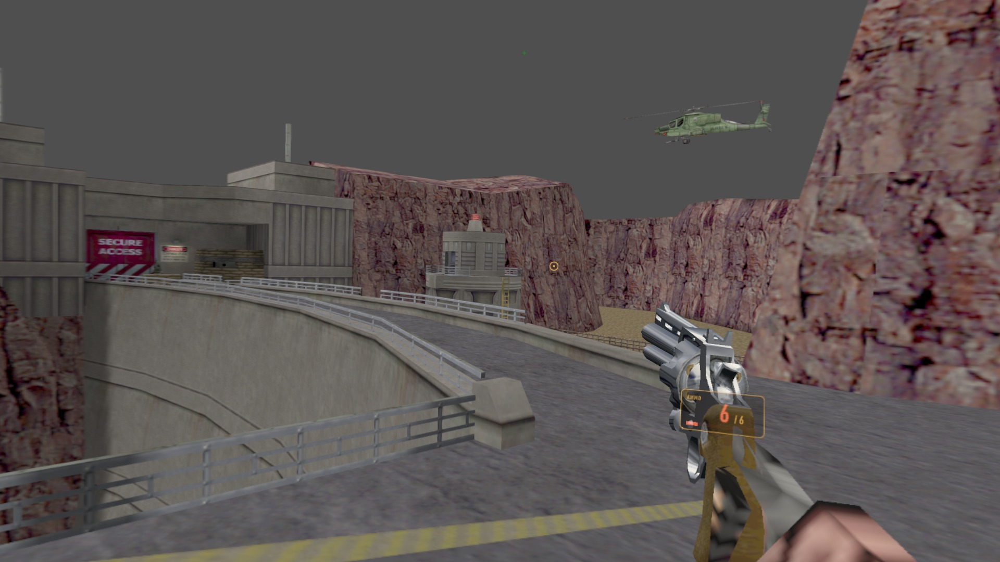

# LambdaVision

Half-Life on Apple Vision Pro — [Xash3D-FWGS](https://github.com/FWGS/xash3d-fwgs)
running its `ref_gl` renderer via [ANGLE](https://github.com/google/angle)
(GLES → Metal) under **CompositorServices**, with a Swift/Metal launcher,
settings, and hand-tracked VR input layered on top. Inspired by
[Lambda1VR](https://github.com/DrBeef/Lambda1VR) (the Quest VR Half-Life
port); built independently from Xash3D-FWGS and hlsdk-portable, no
Lambda1VR code is reused.

GitHub-only distribution. No App Store target. Bring your own Half-Life copy.

See [PLAN.md](PLAN.md) for architecture, phase plan, and risks.



## Status

Playable end-to-end on AVP: engine rendering (foveated, 120 FPS stable),
hand-tracked weapons and locomotion, gaze/pinch menu navigation, a settings
window (graphics/audio/input), spatial-ish audio, and a live performance
HUD are all in and working. The renderer pivoted from an early Vulkan/
MoltenVK prototype to Xash3D's own `ref_gl` driven by ANGLE in May 2026 —
`ref_gl` is the complete, production renderer (studio models, lighting,
particles, decals), whereas the from-scratch Vulkan path only ever reached
~5% feature parity. A Vulkan/MoltenVK smoke test still lives in the
launcher UI as a leftover diagnostic from that earlier phase; it's not
part of the render path.

While the off-hand locomotion clutch is held, LambdaVision renders RAVEInput's
shared joystick visualization as a head-facing outer ring, deadzone ring, and
handle above the movement wrist. It uses the existing Metal weapon/UI arc pass,
so the feedback remains stereoscopic and world-anchored without adding a
RealityKit overlay to the Compositor Services renderer.

**Developer mode** (Settings → Advanced; on by default in Debug builds, off in
Release) shows a debug panel over the off-hand palm and turns on the engine's
verbose developer message stream (`developer 2`). With it off, the engine log
stays quiet. The in-game console and the Advanced tab's console field work
either way.

**Known limitations:** VR input (aiming, locomotion, gestures) is
proof-of-concept quality — functional enough to play, but rough around the
edges compared to the rest of the app. See [ISSUES.md](ISSUES.md) for
specifics, and [PLAN.md](PLAN.md) for the full phase history.

## Prerequisites

* macOS with **Xcode 26.4+** (visionOS 26.4 SDK)
* Apple Vision Pro for testing (Metal 4 / `CompositorServices.MTL4` is not
  available on the visionOS simulator — see Phase 1 notes)
* Apple developer signing identity
* `steamcmd` for fetching Half-Life assets
* Python 3 (for waf, the xash3d-fwgs build system)

## First-time setup

```bash
# This repo and the three shared packages must sit in the same parent directory
git clone https://github.com/illixion/halflife-visionos.git
git clone https://github.com/illixion/RAVESDK.git
git clone https://github.com/illixion/RAVEEngine.git
git clone https://github.com/illixion/DebugTrace.git

cd halflife-visionos

# Open the Xcode project
open LambdaVision/LambdaVision.xcodeproj
```

### RAVE packages

LambdaVision links three shared packages:

| Package | Products used |
|---|---|
| [`RAVESDK`](https://github.com/illixion/RAVESDK) | `RAVEConsole` |
| [`RAVEEngine`](https://github.com/illixion/RAVEEngine) | `RAVEInput`, `RAVEDiagnostics`, `RAVERig`, `RAVEHolo` |
| [`DebugTrace`](https://github.com/illixion/DebugTrace) | `DebugTrace`, `DebugTraceServer` |

All are referenced as **local** Swift packages by relative path —
`../../RAVESDK`, `../../RAVEEngine` and `../../DebugTrace`, resolved against the directory holding
`LambdaVision.xcodeproj` — not as versioned remote dependencies. A clone
therefore does not fetch them, which is why the commands above clone all four
side by side:

```
some-parent/
├── RAVESDK/
├── RAVEEngine/
├── DebugTrace/
└── halflife-visionos/
```

The requirement is only that this repo's parent directory also contains
directories named exactly `RAVESDK`, `RAVEEngine` and `DebugTrace`; this repo's own directory
name does not matter. Get it wrong and Xcode fails at package resolution, before
compiling anything — and before the build phase that fetches xash3d-fwgs runs.

Why path references and not versions: the packages and the apps co-evolve
continuously — the hand input this app uses was converged into `RAVEInput` out of
this app and two others — and a path reference keeps "move this into the package
and update its callers" a single atomic edit.

Update `DEVELOPMENT_TEAM` in the LambdaVision target's signing settings to
your team ID. The app links three prebuilt engine archives that aren't in
git: `libxash.a` (engine + Half-Life game code), `libANGLE.a` (GLES → Metal)
and ANGLE's headers. There are two ways to get them.

**Prebuilt (default).** Just build in Xcode. The pre-build hook
(`scripts/pre-build.sh`) fetches the sources (`xash3d-fwgs`,
`hlsdk-portable`, `MoltenVK.xcframework`), then `scripts/fetch-prebuilts.sh`
downloads whichever archive is missing from this repo's GitHub Releases. The
release tags are content keys (`scripts/prebuilt-keys.sh`: pinned upstream
revisions plus hashes of the patches and build scripts), so you only ever get
archives built from exactly the sources in your checkout. Run the script by
hand to see what it does:

```bash
./scripts/prebuilt-keys.sh      # the release tags your checkout needs
./scripts/fetch-prebuilts.sh    # download what's missing (never overwrites)
```

It never replaces a local file and never fails the build. When there's no
matching release (you're offline, you've edited a patch, or CI hasn't built
these sources yet), the hook stops with an error naming the build script to
run instead. Prebuilt releases include the built-in game ports (Opposing
Force, Blue Shift) that built successfully in CI; those are best-effort.

**Build locally (full support).** Needed when you change the engine, the
patches or ANGLE, and for compiling mods. These are the same scripts CI runs:

```bash
./VisionPort/build_xash_libxash.sh        # libxash.a (needs brew llvm, Python 3)
XR_SIM=1 ./VisionPort/build_xash_libxash.sh  # libxash-sim.a, simulator builds only
./VisionPort/build_angle_visionos.sh      # ANGLE at its pinned revision: ~12 GiB
                                          # gclient sync, slow the first time
./VisionPort/build_game.sh <git-url-or-path> [branch]
                                          # a mod's game code → libgame-<gamedir>.a
```

All are idempotent, and rerunning after a successful build is quick. A local
build is never overwritten by a fetch; delete an archive to go back to the
prebuilt one. After that, build & run on your AVP from Xcode as normal.

## Half-Life assets — pre-25th anniversary build

Half-Life's **25th Anniversary Update** (Nov 2023) made breaking changes to
the engine and game files: shader format changes, asset reorganisation, and
mod-compatibility breaks. Xash3D-FWGS and the Half-Life mod ecosystem expect
the **pre-anniversary** game data.

Valve archived the pre-anniversary build to a public Steam beta branch
called **`steam_legacy`** ("Pre-25th Anniversary Build") for app **70**
(Half-Life). Fetch it with:

```bash
./scripts/fetch-assets.sh YOUR_STEAM_USERNAME       # macOS / Linux
.\scripts\fetch-assets.ps1 -SteamUsername YOUR_STEAM_USERNAME   # Windows
```

Either script downloads SteamCMD to `~/bin/steamcmd` first if it isn't
there already, then runs it non-interactively except for the password /
Steam Guard prompts (never passed as an argument, never stored).

Opposing Force (app **50**) and Blue Shift (app **130**) are optional extra
app IDs, and `--zip` (`-Zip`) packs each game, HD overlay included, into
`build/asset-zips/<gamedir>.zip` for importing on the headset:

```bash
./scripts/fetch-assets.sh --zip YOUR_STEAM_USERNAME 50 130
.\scripts\fetch-assets.ps1 -SteamUsername YOUR_STEAM_USERNAME -ExtraApps 50,130 -Zip
```

Neither expansion has a `steam_legacy` branch: their public build (2020) is
already pre-anniversary. But both pull Half-Life's depots from app 70's
*current* build, which would overwrite a legacy `valve/` installed in the
same folder. So the scripts install them into `build/steam-mods/` and copy
only `gearbox*` / `bshift*` into `HalfLifeAssets/`. Do the same if you run
SteamCMD yourself. Equivalent manual invocation for Half-Life:

```bash
~/bin/steamcmd/steamcmd.sh \
  +force_install_dir "$PWD/HalfLifeAssets" \
  +login YOUR_STEAM_USERNAME \
  +app_update 70 -beta steam_legacy validate \
  +quit
```

This grabs ~507 MB across 5 depots:

| Depot | Manifest                | Size   | Contents                             |
|-------|-------------------------|--------|----------------------------------------|
| 1     | 5928322771446233610     | 430 MB | Main `valve/` (BSPs, WADs, dlls)     |
| 3     | 8096513071444961518     | 0.9 MB | Shared launcher bits                 |
| 71    | 9183617604528345869     | 15 MB  | Half-Life base content                |
| 96    | 8007990985538868417     | 8 MB   | **HD pack** (`valve_hd/`, see below) |
| 9     | 5920416249792874591     | 53 MB  | macOS runtime                         |

(Build ID **5433873**, captured 2026-05-10. Valve does occasionally re-mint
the legacy build; manifests may shift. Depot contents cross-checked against
[SteamDB](https://steamdb.info/app/70/depots/) 2026-09-24 — depot 96 is the
official Gearbox-made "Half-Life High Definition" pack, not a platform
runtime as an earlier version of this table mislabeled it.)

`+app_update 70` pulls all 5 depots for your OS unconditionally — there is
no separate opt-in step for the HD pack. It lands at
`HalfLifeAssets/valve_hd/` alongside `HalfLifeAssets/valve/`; both are
gamedirs `fetch-assets.sh`/`.ps1` fetch and validate in the same run.

**HD pack case-sensitivity note:** the depot ships
`valve_hd/models/Hgrunt03.mdl` with a capital H while the engine requests
`hgrunt03.mdl`. The engine's filesystem and the app's own model loaders
both look files up case-insensitively, so this no longer matters on the
headset; `fetch-assets.sh` still renames it, which is harmless.

### Getting games onto the headset

The app does all preparation on-device: it finds the game folders in
whatever you send, attaches HD overlays to their base game, writes
`vfs.cfg` with `fs_mount_hd "1"` so HD models are active from the first map,
and classifies each game (see below). Three ways to send them:

1. **Wi-Fi (easiest).** Open **Manage over Wi-Fi** from the main window.
   It shows an address (`http://<name>.local:8642`, with the IP as a
   fallback) and a 6-digit PIN. Open the address in a browser on the same
   network, type the PIN, and drop your `HalfLifeAssets` folder (or a
   mod's folder, `.zip`, `.7z` or `.rar`) onto the page. Only files that
   differ are sent, an interrupted transfer resumes, and the page also
   lists, activates and deletes installed games. The server runs only
   while that window is open.
2. **AirDrop / Files.** `fetch-assets.sh --zip` writes one zip per game to
   `build/asset-zips/`; AirDrop them and choose *Open in LambdaVision*, or
   use **Import** in the app. `Documents/GameData` is also visible in the
   Files app.
3. **Developers with a cable:** `./scripts/push-assets.sh` copies every
   gamedir into `Documents/GameData` via `devicectl` (incremental;
   `--delete` mirrors removals). `./scripts/push-assets.sh --wifi
   <host:port>` does the same over the Wi-Fi API. To try the page on the
   Mac, `swift run library-server <some GameData dir>` in
   `LambdaVision/Packages/GameLibrary`.

Imported games live in the app's data container: they survive reinstalls
but not deleting the app. In-game, `K` sends `impulse 101` (give-all) so
you can inspect every weapon's viewmodel immediately.

### Expansions and mods

The main window lists every installed game; pick one and the engine starts
it with `-game <dir>` at its liblist start map. Switching games needs an app
relaunch (the engine's own *Change game* asks you to reopen the app). Game
code is compiled into the app — visionOS can't load a mod's DLL — so games
fall into four tiers:

| Tier | What | Support |
|---|---|---|
| Built-in | Half-Life, Opposing Force, Blue Shift | compiled in (`VisionPort/games.list`) |
| Compiled by you | any hlsdk-portable-based mod source | `./VisionPort/build_game.sh <git-url-or-path> [branch]`, then rebuild the app; the VR layer (`VisionPort/hlsdk-vr`) is applied automatically |
| Content-only mods | map packs and mods that use Half-Life's own code | just import them |
| Custom-DLL mods | Windows DLL, no source | *Experimental*: maps load on Half-Life's code, the mod's own entities are missing |

Mods written against the original Windows SDK need porting first; see
FWGS's mod porting guide.

For a self-contained app (assets baked into the bundle — e.g. handing a
build to someone), build with `BUNDLE_HL_ASSETS=1` set (re-enables the
"Bundle HalfLifeAssets" Run Script phase), e.g.
`xcodebuild ... build BUNDLE_HL_ASSETS=1`, or add it as a build setting in
Xcode; the engine falls back to `<bundle>/GameData` when no Documents copy
exists.

The folder is NOT redistributable; it's already gitignored.

### Why pre-anniversary specifically

* The **25th-anniversary engine** changes the renderer/shader pipeline. Xash3D
  is built against the pre-anniversary engine model.
* Many existing HL mods break on the 25th-anniversary build for the same
  reason; Lambda1VR (our reference) targets the pre-anniversary game.
* Xash3D-FWGS will load 25th-anniversary `valve/` BSPs but rendering and
  some game logic edge-cases differ. Don't fight it; use legacy.

## Controls

With **Immersive gesture input** on (Settings → Input, the default), the game
is played with hand tracking:

| Action | Gesture |
|---|---|
| Aim | Point the weapon hand; the hand-tracked weapon follows it |
| Fire | Curl your dominant index finger (finger-gun) |
| Reload | Curl your thumb down with the index extended, hold until the ring fills |
| Alt-fire | Press your thumb tip against the side of your curled middle finger (index still pointing); held while it stays there (Settings → *Alt-fire: thumb to middle finger*) |
| Move | Pinch thumb+index with the other hand and drag like a joystick |
| Jump / crouch | Raise or drop the pinched hand |
| Long jump | Jump at a full run once you have the long jump module (Settings → *Long jump at a run*) |
| Switch weapon | Pinch all fingertips together, move toward a weapon's icon, release; pick a slot again to cycle it |
| Flashlight | Weapon wheel → LIGHT |
| Quick save / load | Weapon wheel → SAVE, or LOAD (hold it armed until its outer arc fills) |
| Use / buttons | Poke with the off-hand index finger; rest an open palm on chargers |
| Train throttle | Poke the console, then pinch and push/pull; poke again to let go |

**Arm-swing walking** (Settings → Input, on by default) is the alternative to
the pinch joystick:

1. Close both hands into fists and pump your arms like jogging. The harder
   you swing, the faster you walk, up to full run speed.
2. Flick both fists up together to jump.
3. Once you're running, point your gun hand (finger-gun) to aim and fire while
   the other arm keeps you running. That arm's flick alone then jumps. Swing
   the gun hand as a fist again to put it back into the run.
4. A held pinch always wins over a swing, so the two can be mixed freely.

*Swing direction* picks whether you go where you look or where your fists
point, and *Swing sensitivity* (0.5×–2×) sets how hard you need to swing.

Alt-fire and reload are both thumb gestures: after one, lift the thumb before
the other. Curl the index while holding alt-fire to press both buttons.
*Alt-fire sensitivity* sets how close the thumb has to come; lower it if
reloading sets off alt-fire.

### Keyboard, mouse and gamepad

A Bluetooth keyboard and mouse, or a gamepad, play the game like desktop
Half-Life in stereo. **Input mode** (Settings → Keyboard, mouse & gamepad)
on *Auto* follows the last device used: a key, the mouse or the gamepad
switches to it at once, and a look-and-pinch brings the hands back once the
device has been still for a second (or when it disconnects). Outside hands
mode the weapon is the classic viewmodel in front of you, shots go where you
look (the stock crosshair marks it), the body's arms stop following your
hands and the hand gestures rest. *Hands*, *Keyboard + mouse* and *Gamepad*
pin the mode instead. The launcher's Diagnostics shows the current mode.

The HEV suit holograms move with the mode. In hands mode ammo floats beside
the gun hand and health and suit over the off-hand forearm. With a keyboard,
mouse or gamepad they become a Half-Life 2 style overlay: health and suit at
the lower left of the view, ammo at the lower right. The overlay trails the
head by a short, capped lag, so it reads as a hologram beside Gordon's head
rather than a sticker on the lens. Settings → Keyboard, mouse & gamepad →
*HEV holograms* switches back to *Attached to hands*.

Every mode reaches stock full run speed; nothing changes the movement
speeds. Keyboard and mouse binds are ordinary engine binds, set on first run
and rebindable in the game's menu (Configuration → Controls). Settings also
lists them under *Controls*.

| Keyboard | Action |
|---|---|
| W A S D, ↑ ↓ | Move |
| ← → | Turn (smooth) |
| Z / X | Snap turn left / right (*Snap-turn angle* in Settings) |
| Space | Jump |
| Ctrl | Crouch (hold, then Space: long jump) |
| Shift | Walk |
| E | Use |
| R | Reload |
| F | Flashlight |
| 1–0 | Weapon slots |
| [ / ] | Previous / next weapon |
| Q | Last weapon |
| J or Enter | Fire (for playing without a mouse) |
| K | Alt-fire |
| F5 or F6 | Quick save |
| F9 or F7 | Quick load |
| T | Spray |
| Esc | Menu |
| ~ | Console |

| Mouse | Action |
|---|---|
| Move | Turn smoothly (and look up/down with *Look up/down* on) |
| Left button | Fire |
| Right button | Alt-fire |
| Wheel | Previous / next weapon |
| In the menu | Move the cursor; click to select |

| Gamepad | Action |
|---|---|
| Left stick | Move |
| Right stick | Turn, smooth (*Stick turn speed*, 100°/s default) or snap |
| Right trigger | Fire |
| Left trigger | Alt-fire |
| A | Jump |
| B | Crouch (hold, then A: long jump) |
| X | Reload |
| Y | Use |
| Left shoulder | Walk |
| Right shoulder | Last weapon |
| D-pad ← → | Previous / next weapon |
| D-pad ↑ | Flashlight |
| View / Options | Tap: quick save · hold 1 s: quick load |
| Menu | Menu |

*Mouse sensitivity* uses Half-Life's scale (3 is the stock default). *Look
up/down* (off by default) adds mouse and right-stick pitch to your head's.
It tilts the game's horizon away from the room's, which some find
uncomfortable, and the first-person body hides while a tilt is set.

## Build & run cheat sheet

```bash
# One-time engine builds, only if you don't use the prebuilts
# (see First-time setup above for details)
./VisionPort/build_xash_libxash.sh
./VisionPort/build_angle_visionos.sh

# Compile another game's code into libxash.a (any hlsdk-portable-based source;
# the VR layer in VisionPort/hlsdk-vr is applied automatically)
./VisionPort/build_game.sh https://github.com/FWGS/hlsdk-portable opfor
./VisionPort/build_game.sh https://github.com/FWGS/hlsdk-portable bshift
./VisionPort/pack_libxash.sh   # re-fold games/libgame-*.a into libxash.a

# Engine smoke build for visionOS simulator (dedicated server only, no GL)
./VisionPort/build_xash_xrsim.sh

# App build for AVP device
xcodebuild -project LambdaVision/LambdaVision.xcodeproj \
  -scheme LambdaVision \
  -destination 'id=YOUR_AVP_UDID' \
  -configuration Debug build

# Install
xcrun devicectl device install app \
  --device YOUR_AVP_UDID \
  ~/Library/Developer/Xcode/DerivedData/LambdaVision-*/Build/Products/Debug-xros/LambdaVision.app

# Launch and stream logs
xcrun devicectl device process launch \
  --device YOUR_AVP_UDID --console com.illixion.LambdaVision
```

Find your AVP's UDID with `xcrun xctrace list devices`.

## Layout

```
LambdaVision/      Xcode visionOS app (Swift + C bridge + ANGLE)
VisionPort/        Engine cross-compile workspace (xash3d-fwgs + hlsdk-portable
                   + patches + setup)
scripts/           Asset fetch/push scripts, prebuilt fetch and the Xcode pre-build hook
.github/workflows/ CI compile check and the prebuilt ANGLE / libxash releases
PLAN.md            Architecture, phase plan, risks
docs/plans/        Design plans for planned work (one file per plan)
ISSUES.md          Known problems
README.md          You are here

../RAVESDK/        Shared package, cloned as a sibling (see First-time setup)
../RAVEEngine/     Shared package, cloned as a sibling (see First-time setup)
../DebugTrace/     Shared package, cloned as a sibling (see First-time setup)
```

## Licensing

This repo doesn't contain a single license — three different bodies of code
are involved, and they're licensed separately:

* **This repo's own source** (Swift app, Metal passes, build scripts,
  patches against xash3d-fwgs) — **GPLv3**, see [LICENSE](LICENSE). This
  isn't just a style choice: `xash3d-fwgs` is GPLv3, and this app statically
  links the engine into a single binary rather than running it as a separate
  process, so the combined binary is a derivative work and GPLv3's copyleft
  applies to the whole thing.
* **`hlsdk-portable`** (cloned by `VisionPort/setup.sh`, extended by
  the VR layer in `VisionPort/hlsdk-vr/`) — Valve's original **Half-Life 1 SDK
  LICENSE**, not GPL. It permits free copying, modification, and
  distribution of the SDK and your modifications, in source or object form,
  but only for free (no charge) and only distributed together with that
  LICENSE file. `VisionPort/hlsdk-vr/` (the VR layer's sources and its hook
  patch) is a derivative of Valve's SDK code and is bound by those same
  terms, not GPLv3. So is any mod source `VisionPort/build_game.sh` builds.
* **Half-Life game assets** (`HalfLifeAssets/`) — Valve's property, never
  redistributed here (gitignored; fetched by each user from their own Steam
  account via `scripts/fetch-assets.sh`). See
  [Half-Life Legacy](https://developer.valvesoftware.com/wiki/Half-Life_Legacy)
  for Valve's policy.

This project is a fan-made, non-commercial port and is not affiliated with
or endorsed by Valve Corporation. Half-Life is a trademark of Valve
Corporation.

LambdaVision also links [RAVESDK](https://github.com/illixion/RAVESDK) and
[RAVEEngine](https://github.com/illixion/RAVEEngine) as local Swift package
dependencies; both are MIT-licensed (unaffected by the GPLv3 obligation
above, since that only reaches the combined LambdaVision distribution, not
the packages' own repos). See [THIRD-PARTY-LICENSES.md](THIRD-PARTY-LICENSES.md)
for their license text.
